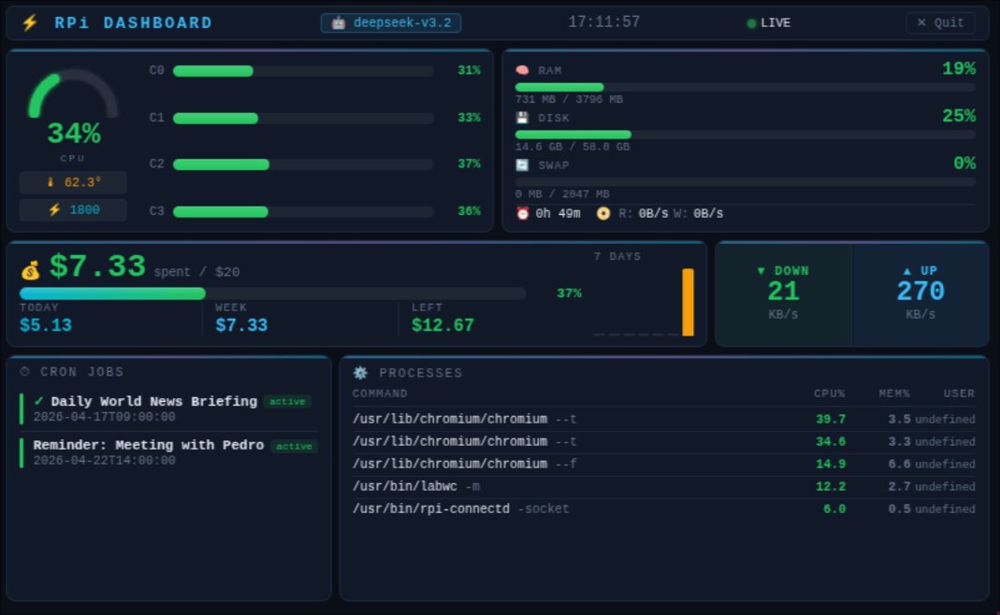

# hermes-agent-dashboard

A lightweight dashboard for monitoring a [Hermes](https://github.com/nousresearch/hermes-agent) agent running on a Raspberry Pi. Displays real-time system metrics, OpenRouter API usage, cron jobs, and top processes — designed for an 800×480 touchscreen.

